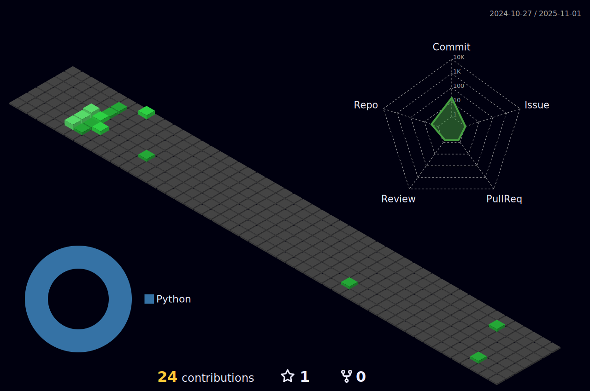

### Hi there 👋

<!--
**JonathanRaines/JonathanRaines** is a ✨ _special_ ✨ repository because its `README.md` (this file) appears on your GitHub profile.

Here are some ideas to get you started:

- 👯 I’m looking to collaborate on ...
- 🤔 I’m looking for help with ...
- 📫 How to reach me: ...
- 😄 Pronouns: ...
- ⚡ Fun fact: ...
-->
- 🔭 I’m currently working on a PhD in Artificial Intelligence
- 🌱 I’m currently learning about AI safety, generative design, and physics informed neural networks.
- 💬 Ask me about my time at [Open Bionics](https://openbionics.com/)

<!--  -->